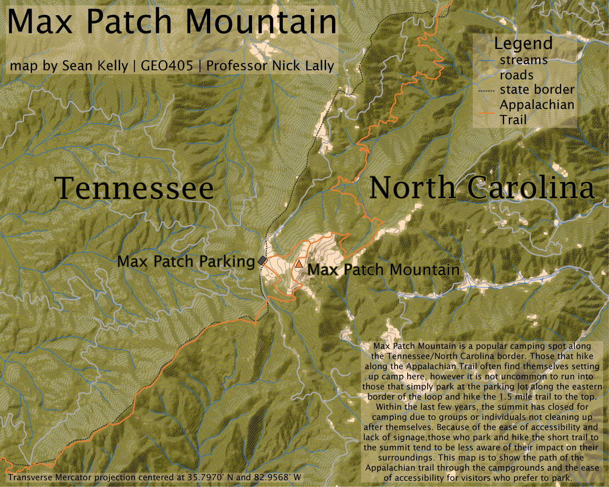

# Max Patch Mountain
## Max Patch mountain is located on the border of Tennessee and North Carolina in Madison County (NC) and Cocke County (TN)

A popular spot to camp among teenagers and families, or a place to take in the view for Appalachian Trail hikers, Max Patch is one of the most beautiful, scenic spots in
the Appalachians. In 2021, however, the Forest Service decided to close the peak for camping for two years after visitors constantly trashed the area. Those two years are coming to an end in June of 2023, and this is a map in celebration of it reopening, signifying its location along the Appalachian Trail. 

     
*Max Patch Mountain in Madison and Cocke counties*

[Link to high-resolution version](MaxPatchFinal.pdf)     

The map was created and styled using Blender, Adobe Illustrator, and Adobe Photoshop. Data retrieved from naturalearthdata.com and USGS. 